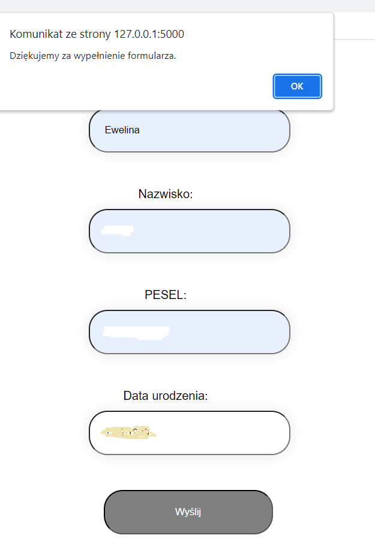
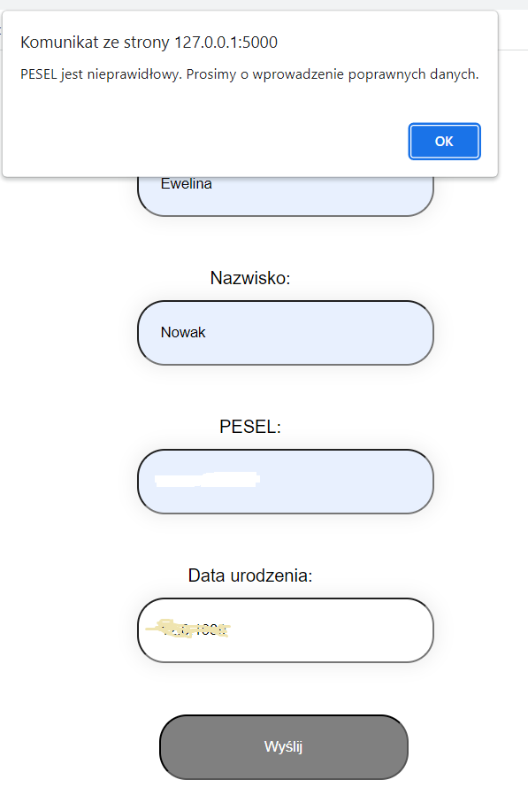
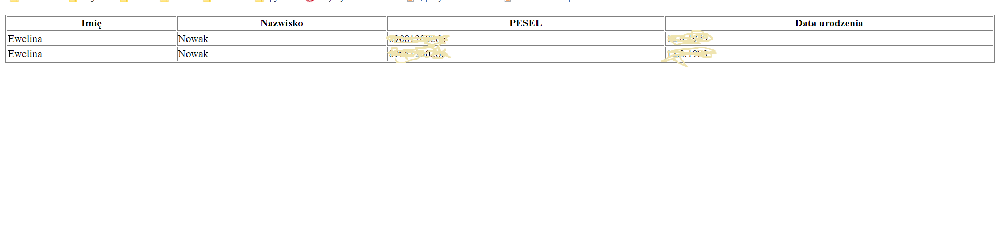
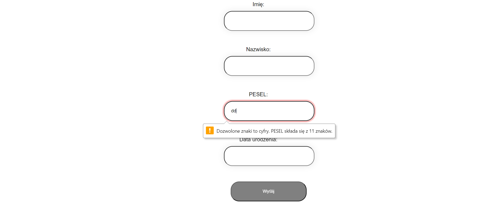
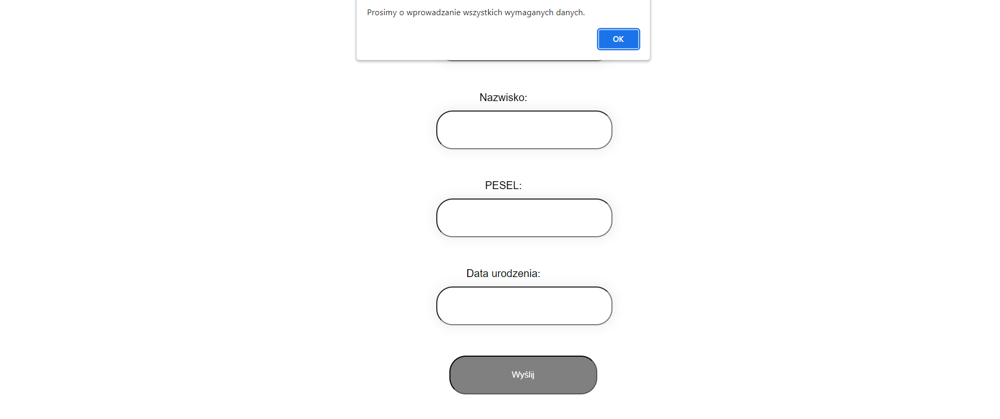

## About

Simple form with validation and completion of the date of birth based on the PESEL number.
Data from correctly completed forms are saved in the database.

## Installation

* git clone
* cd project
* pip install -r requirements.txt

## Tech stack

* HTML, CSS, Javascript
* Python, Flask, sqlite

## Usage

* set enviromental variable:  FLASK_APP=app
* flask run

* The form is available at url:
http://127.0.0.1:5000/form/

* The table is available at url:
http://127.0.0.1:5000/users/

- - - -

## Screenshots demonstrating flow

