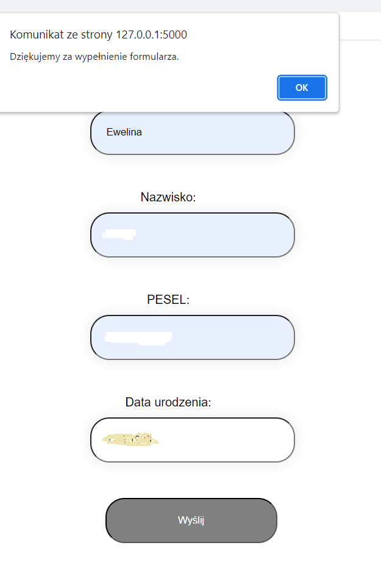
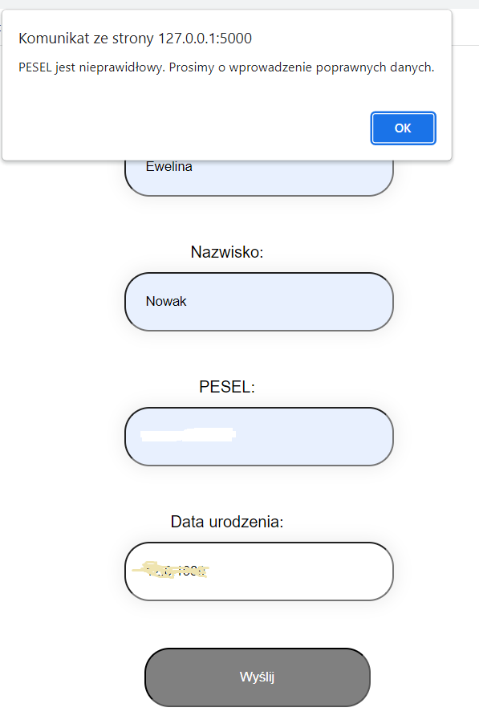
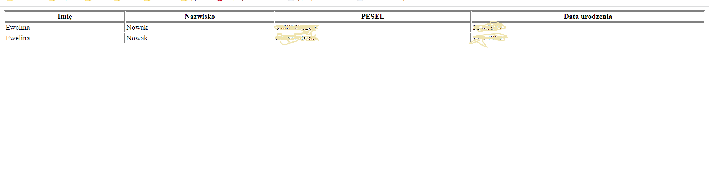

## About

Simple form with validation and completion of the date of birth based on the PESEL number.
Data from correctly completed forms are saved in the database.

## Installation

git clone
cd project
pip install -r requirements.txt
set enviromental variable:  FLASK_APP=app
flask run

## Technological stack

Python, Flask, sqlite
HTML, CSS, Javascript

## Usage

http://127.0.0.1:5000/form/
http://127.0.0.1:5000/users/

